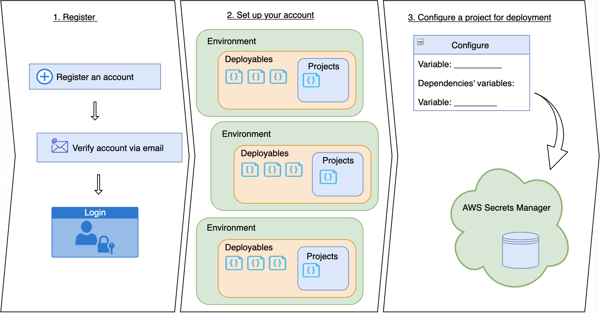
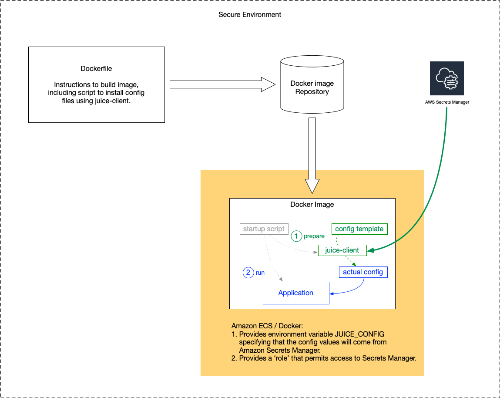

## Introduction
### What is Juice?
Juice is a config tool for AWS that assists programmers and non-programmers alike by creating a simple and intuitive process that ensures projects are managed effectively at each stage of product development and deployed correctly every time. This system promotes security, transparency and consistency above all. 

### Why is it useful? 
Deployment can become a nightmare if your processes rely on individuals to maintain consistent and accurate config files. Most programmers develop their own procedures for deployment and storing sensitive information, and whilst companies may have recommended best practices, it’s easy for things to slip through the cracks due to human errors such as miscommunication, inexperience or just plain-old laziness. These mistakes are not only annoying but can pose serious security risks and can be damaging to client relationships. This is where Juice becomes a valuable asset in your future deployments.

Juice provides a simple, easy-to-use solution for configuring projects that prevents easily-made human errors. The procedure provided by Juice is safe guarded to prevent unauthorised personnel from making potentially damaging changes to existing infrastructure or projects. It also ensures that config files are consistent, thorough and values are recorded carefully and thoughtfully. 

#### Objectives
* To make development simple and standalone by removing the complications of production config considerations.
* To prevent storing config values and secure information in the source code and build scripts.
* To provide restricted access to secure information and the production system.
* To offer simplified, consistent, error free Ops by:
  * Defining all that is required
  * Removing the risk of accidentally copying parameters from one environment to another
  * Generating reliable templates and scripts
  * Fast recognition of missing config values
* To ensure that the same source code is used throughout, despite having different locations for the config definitions.
* To use the same Docker image across all non-dev environments.
* To remove double entry of config values (e.g. server starts on specific port, client uses that port as it’s endpoint).

### Is it secure?
Juice does not store or manage any sensitive information. During the project config process Juice will request variable values for the project and each of its dependencies. This data is then stored in AWS Secrets Manager or in your local storage, depending on your required environment. Juice simply provides a safe-guarded procedure for recording config values that ensures smooth project deployment every time.

## Getting Started
### How to register
Your account will be registered using LoginService, a ToolTwist authentication tool. You must sign up using your email address, then create a new password and a verification email will be sent to your inbox. Once verified you can login using the homepage at www.juiceconfig.io. 
 
<i>‘I forgot my password, what can I do?’</i> - Simply select the ‘forgot password’ option and a password reset will be sent to your designated email address. 

### Setting up your account
#### Understanding your intended use
Juice can be used by individuals or businesses and caters to a variety of different roles. The way that you set up your account will reflect your intended use. If you are looking to set up a personal account to create a stream-lined process but do not need to include other users, simply register at the login page and set a password, then confirm your account via email. As a business, you will need to set up the account as a superuser, then add in users manually and individually select their accessibility based on their role for each deployable and/or environment once the account has been set up. 

#### Getting to know the layout
There will be a variety of familiar terms you will see on the website. To avoid confusion, make sure you understand what they require before entering in any data: 

Glossary | Description
------------- | -------------
Deployables  | Deployables are programs that can be either existing projects or software that the projects require to run (such as mySQL, ContentService or LoginService).
Project  | A project is a program that is in the process of development. Not all deployables will be projects. 
Deployments | Deployments are deployables that are in the process of being configured with a selected environment. You must declare the relationship between the deployable and the environment in the deployable tab before config. 
Dependencies | Dependencies are deployables that are required to run exisiting projects and other deployables. For example, a project might require LoginService and ContentService to run, therefore they would be the projects dependencies. A dependency might also have its own dependencies, which would be declared on its own deployables page.
Environments | Environments should be managed by infrastructure, and devs should only have access to development environments. These can refer to environments on a local server or otherwise (such as UAT, pre-production, production etc).
Variables | Variables are the configurable values that are required for each project to be deployed (such as endpoints or database name). Variables should be created for every deployable and their dependencies, and each variable will be given values when configuring a project. 

#### Adding data
The rest is intuitive and the process of adding information is up to you. However, generally we might suggest the following order:  (This will include screen shots as a guide, once the UI is ready)
1. Your first step could be to add deployables. Depending on how complicated or numerous your programs are, this might take a while. Alternatively you may wish to add all deployables relevant to a certain project, then go through the entire process for each project to ensure that you do not miss any dependencies (deployables) for that project. 
2. Next, you should populate the relevant fields for each deployable. This includes entering in the deployables variables and dependencies. You should have all deployables added already, so adding dependencies is as simple as selecting the deployable from a list.
3. Adding environments will be the simplest part of the process. Simply add the names and specifications of your environments.
4. Next add the names and roles for users who will need access to Juice. The users tab will only be viewable for the superuser or read/write users. This displays a list of all users with access to your Juice account, their accessibility which can be edited, and the projects and environments that they are involved in. 
5. Lastly, as a superuser you will need to manually add users to each project or environment, or create read/write access for other users so that they can add themselves and members of their team to projects and environments where applicable. However, it is important to limit users that have read/write access to minimise the chances of human error.


<br>
<br>
<div style="max-width: 600px;">
  
</div>


## Configuring a project
### Overview
To configure any project you will first need to select the project in the relevant environment tab, then select ‘configure’. This will bring you to a screen that displays the projects variable names and the dependencies’ variable names. You will need to fill in all fields, then click send. This will create a text file that can be reformatted for your specific purposes. The next steps will be determined based on your required environment.

(SCREEN SHOT OF ENVIRONMENT>DEPLOYABLE>CONFIGURE BUTTON)
(SCREEN SHOT OF CONFIG FORM) 

#### Using Juice-client CLI in a Docker container
Our objective with juice-client is to use the same Docker image in different environments, whilst still updating the config files as your project develops. This means the same image will be used on the developers desktop machine/laptop AND on AWS servers during continuous integration (CI), development testing, User Acceptance testing (UAT), staging and production environments. In this sense, the applications are protected against unwarranted changes during deployment from one environment on to the next.

#### Where are the configs stored?
Depending on the environment, the config will be stored in either a flat JSON format or on AWS Secrets Manager. Examples:

```
export JUICE_CONFIG='file:::/opt/Development/Projects/juice/juice-config/local-server/volumes/juice/config/config-for-juice.json'

export JUICE_CONFIG='secrets_manager:::ap-southeast-1:::PHILTEST'
```

*In the second example, the ap-southeast-1:::PHILTEST part is an identifier provided by AWS Secrets Manager. See the AWS Documentation for details.

### Desktop development and testing
For desktop development and test environments, a flat file will be created with the config, which will then be sent to the application in its designated environment. This will not be a secure environment.


<br>
<br>
<div style="max-width: 600px;">
  
</div>


### Pre-production and production
For pre-production and production environments, the flat file generated in desktop development and test environments will be reformatted based on your environments specific requirements. This will then be sent to AWS Secrets Manager where you will be required to provide authorisation before storing the new config. This will be a secure environment. It is only at this stage that sensitive values should be stored in the config file.


<br>
<br>
<div style="max-width: 600px;">
  
</div>


##### juice-client as a library in a NodeJS application
NodeJS applications will be able to access AWS Secrets Manager directly, as seen in the diagram below. This means that you will not be required to reformat the config file and it can be sent directly from Juice-client to AWS Secrets Manager. 


<br>
<br>
<div style="max-width: 600px;">
  
</div>


NodeJS programs will require the juice-client package to be installed in order to access config values. To install juice-client package from NPM, simply run the following in your terminal:

```
 # npm install @tooltwist/juice-client --save
```
In your program you will be required to define the following values: 
```
  const juice = require('juice-client')

  let value = juice.stringValue(name, defaultValue/*optional*/)
  let value = juice.intValue(name, defaultValue/*optional*/)
```

The value returned will be determined by:
1. If the value is defined in the config it will be returned.
2. If a default value is specified, it will be returned.
3. If the default value is juice.OPTIONAL, then the default value for the type will be returned (an empty string, or -1 for numeric values).
4. If the default value provided is juice.MANDATORY, an exception is thrown. Typically the program should immediately log the error and shut down.
5. If no default is specified, then juice.MANDATORY is assumed.

#### juice-client as a library in non-NodeJS application
As non-NodeJS application config requirements are more complex, AWS Secrets Manager will access juice-client outside of the application, which in turn will use a flat file to configure and send to the application. 


<br>
<br>
<div style="max-width: 600px;">
  
</div>


Libraries for languages such as Java and GoLang are currently in progress. For now, we recommend using juice-client as a CLI. Check out the instructions in the next section.


### Using the CLI
##### juice-client as a CLI

<br>
<br>
<div style="max-width: 600px;">
  
</div>


Docker images are created using a Dockerfile and using the “docker build” command. See the Docker documentation for more details. 

We’ll update the config files at the time the docker container starts, just before the application starts. For this to happen several things need to be set up:

1. Once juice-client is installed, we build the application’s Docker image. The Dockerfile will also need NodeJS installed prior to running these commands:

```
# Install juice-client
RUN mkdir /juice-client
WORKDIR /juice-client
RUN echo {} > package.json
RUN npm install --color false @tooltwist/juice-client --save

COPY config-template /juice-client-config-template

CMD ["bash", "some-script.sh"]
```

2. The script used to start the application should use juice-client to create the config files from template config files. For example:

```
CMD=/juice-client/node_modules/\@tooltwist/juice-client/lib/juice-client
node ${CMD} install /juice-client-config-template/template-config-file1.config /somewhere/config/real-config-file1.config
[check exit status (see example below)]
node ${CMD} install /juice-client-config-template/template-config-file2.xml /somewhere/config/real-config-file2.xml
[check exit status]
node ${CMD} install /juice-client-config-template/template-config-file3.json /somewhere/config/real-config-file3.json
[check exit status]
...
[start the application]
```

Binary files are copied without changes. ASCII and Unicode files are handled. An entire directory can be copied recursively.

```
CMD=/juice-client/node_modules/\@tooltwist/juice-client/lib/juice-client
node ${CMD} install /juice-client-template-config-directory /somewhere/config
if [ $? != 0 ] ; then
    echo FATAL ERROR WHILE INSTALLING CONFIG FILES.
    echo SERVER WILL SHUT DOWN
    sleep 60
    exit 1
fi
...
[start the application]
```

This command returns with zero if the install worked correctly and all config variables are assumed to be mandatory.

If any of the config files refer to a config value that has not been defined, the script should display an error message, pause for a short while, then shut down. The Docker container will be restarted by AWS ECS, and the sleep prevents it from cycling too fast through the recycles. The intention is that the admin will see the error and update AWS Secrets Manager with the missing config values.

3. AWS ECS requires to be told to start the Docker image with - 
a) Environment variable JUICE_CONFIG pointing to the appropriate AWS Secrets Manager secret.
b) ECS can assign a permissions ‘role’ to a running Docker container. This role grants the entity with the role (i.e. our Docker container) access to resources. The administrator should assign a role to our Docker container that has access to the specified AWS Secrets Manager secret.

And that’s it. Super simple, super intuitive.
Good luck and happy coding!